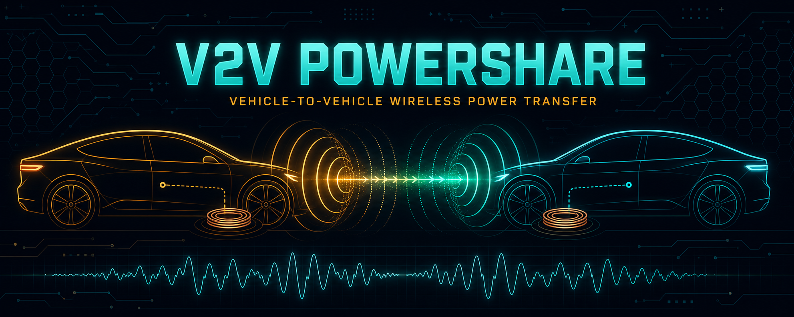
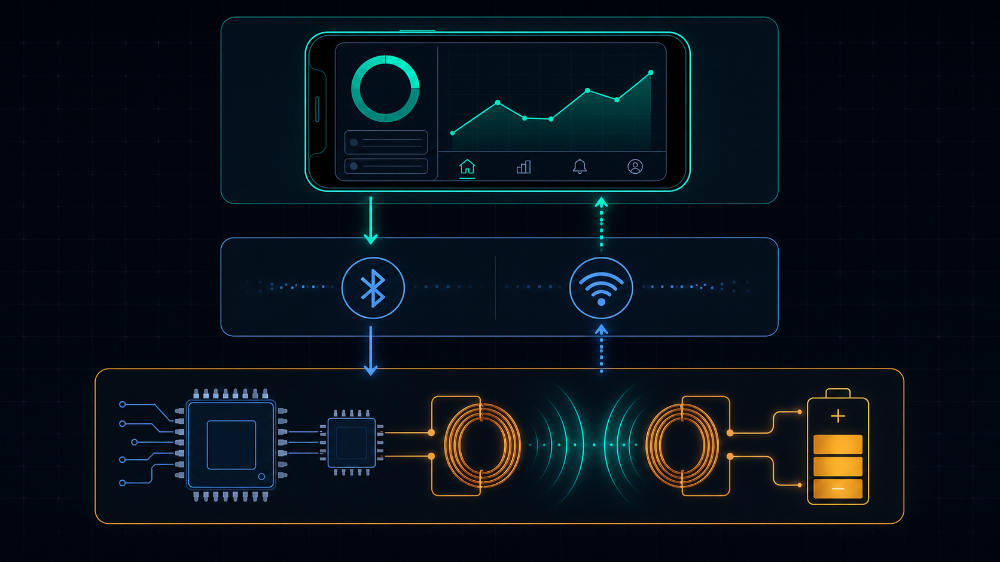
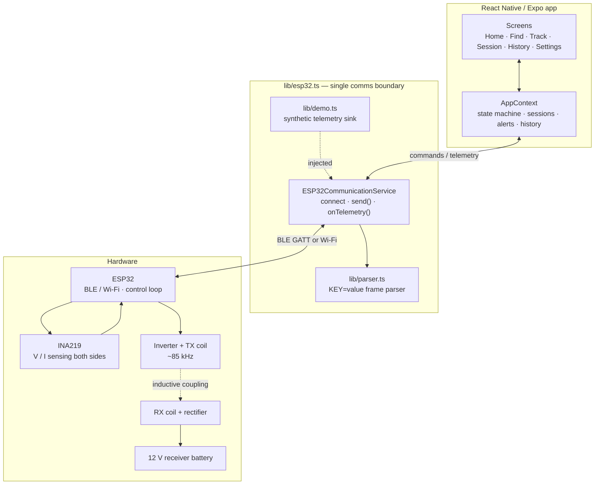

<p align="center">
  
</p>

<p align="center">
  <a href="https://eee2k25.github.io/WirelessPowerTransfer/"></a>
  
  
  
  
</p>

# V2V PowerShare

A cross-platform control and monitoring app for **vehicle-to-vehicle (V2V) wireless power transfer** on a campus EV testbed. One EV acts as a **Donor**, another as a **Receiver**; the app handles discovery, consent, meet-up, the live inductive transfer session and the post-session log — while the ESP32 and the power stage keep the actual electrical safety in hardware.

> **Live demo:** <https://eee2k25.github.io/WirelessPowerTransfer/>
> Runs in **Demo Mode** by default, so every screen is explorable with synthetic telemetry and no hardware attached.

---

## Mission

Campus EVs and e-scooters run flat in places where no charger exists. Rather than towing or a cable that nobody carries, **V2V PowerShare** lets a nearby vehicle with spare charge donate a small top-up over a resonant inductive link, mediated entirely by the app: find → request → consent → system check → transfer → log.

### Lab envelope

This is a **student power-electronics testbed**, not a road-legal fast charger. The reference bench runs:

| Parameter | Bench value |
|---|---|
| Bus voltage | **12 V** nominal (12.0 – 12.6 V observed) |
| Transfer power | **~15 W** shareable (8 – 18 W per donor profile) |
| Switching / resonant frequency | **~85 kHz** (83 – 87 kHz band) |
| Coil-to-coil efficiency | 70 – 90 % typical, ~80 % steady state |
| Coupling gap | transfer armed only inside **3 m** vehicle-to-vehicle |
| Default guard rails | 14.5 V max, 2.5 A max, 55 °C max, 30 min max session |

---

## System architecture

<p align="center">
  
</p>



**Design rule: screens never touch hardware.** Every screen talks to `AppContext`, which talks to `ESP32CommunicationService`. Demo telemetry is *injected into the same service*, so swapping the simulator for a real BLE transport changes exactly one file.

### WPT signal path

```
12 V donor battery → DC/DC + H-bridge inverter → resonant TX coil (LC, ~85 kHz)
        ⇢ air gap ⇢
resonant RX coil → rectifier + filter → CC/CV stage → 12 V receiver battery
              ↑ INA219 shunt monitors on both sides → ESP32 → app
```

---

## Communication protocol

The ESP32 emits flat, human-readable **`KEY=value`** frames over BLE (or Wi-Fi), comma separated. Unknown keys are ignored and missing keys fall back to the previous frame, so partial frames never corrupt the dashboard.

**Telemetry frame**

```
DONOR_V=12.40,DONOR_I=1.20,DONOR_P=14.88,RX_V=10.80,RX_I=1.10,RX_P=11.88,
TX_V=11.90,TEMP=32.5,RX_TEMP=30.1,FREQ=85,EFF=79.8,SOC_D=82,SOC_R=65,WPT=ON,FAULT=NONE
```

| Key | Meaning | Unit |
|---|---|---|
| `DONOR_V` / `DONOR_I` / `DONOR_P` | Donor-side bus voltage, current, power | V / A / W |
| `TX_V` | Inverter / TX coil drive voltage | V |
| `RX_V` / `RX_I` / `RX_P` | Receiver-side rectified voltage, current, power | V / A / W |
| `TEMP` / `RX_TEMP` | Donor and receiver coil-stage temperature | °C |
| `FREQ` | Resonant operating frequency | kHz |
| `EFF` | End-to-end efficiency (`RX_P / DONOR_P`) | % |
| `SOC_D` / `SOC_R` | Donor / receiver state of charge | % |
| `WPT` | Power stage gate state | `ON` / `OFF` |
| `FAULT` | Active fault code | `NONE`, `OVERTEMP`, … |

**Commands (app → ESP32)** — serialized as `CMD` or `CMD|k=v,k=v`:

| Command | Purpose |
|---|---|
| `START_WPT` | Arm and energise the transfer (only from `ready`) |
| `STOP_WPT` | Graceful ramp-down and gate off |
| `EMERGENCY_STOP` | Immediate shutdown, session marked `emergency` |
| `GET_STATUS` | Request a fresh telemetry frame |
| `ACCEPT_REQUEST` / `REJECT_REQUEST` | Donor's answer to an incoming request |
| `CANCEL_REQUEST` | Receiver withdraws a pending request |
| `END_SESSION` | Close the session and write the history record |

**Session state machine**

```
idle → checking → ready → active → stopping → completed
                    ↘        ↓
                     fault / emergency → idle (after clear)
```

---

## Privacy-first proximity

A receiver stranded on campus needs a donor to *find* them — without broadcasting a GPS pin to strangers. `lib/location.ts` publishes only a **derived, coarse locator**:

- **Zone** — a named campus area (`Power Lab Court · WPT test pad`, `South Gate Bay · visitor parking`, …)
- **Rounded distance band** and **compass heading** (`~120 m northeast`)
- **ETA estimate** for a walk/roll over

Exact coordinates never leave the device while **Hide exact location** is on (default). Range gates derived from the same layer:

| Gate | Radius | Effect |
|---|---|---|
| Notify radius | **250 m** (configurable) | Donor receives the proximity ping |
| Meet range | **15 m** | "You're together" — proceed to system check |
| WPT range | **3 m** | `START WPT` becomes enabled |

---

## Safety model

**The app commands. The hardware protects.** Nothing in this repo is the last line of defence.

| Layer | Owner | Responsibility |
|---|---|---|
| Pre-flight system check | App | Both vehicles linked, ESP32 connected, SOC acceptable, no active fault, requested power within limit, proximity ready |
| Consent | App | No transfer without an explicit donor **ACCEPT** |
| Limits | App settings | Max voltage 14.5 V, max current 2.5 A, max temp 55 °C, min donor SOC 40 %, max duration 30 min |
| Confirmation | App | Destructive actions (`START`, `EMERGENCY STOP`) are double-confirmed |
| Emergency stop | App → ESP32 | One tap, always reachable during an active session |
| **Over-voltage / over-current / over-temp trip** | **ESP32 + power stage** | **Hardware cut-off, independent of the phone** |
| Faults | ESP32 | Reported as `FAULT=…`; the app latches the session into `fault`, logs it, and refuses restart until cleared |

If the phone dies, disconnects, or crashes mid-transfer, the hardware watchdog is what stops the transfer — by design.

---

## Screens

| Screen | What it does |
|---|---|
| **Splash → Role** | Brand intro, then choose **Donor EV** or **Receiver EV**; the role reshapes the whole app |
| **Home** | Battery ring, live link status strip, role-specific hero action (Go online / Find donors), proximity notices |
| **Find** | *Receiver:* browse nearby donors with SOC, available power, zone and heading; send a power request. *Donor:* inbox of incoming requests with **ACCEPT / REJECT** |
| **Track** | Privacy proximity map, live request ping, "how the donor is notified" explainer, notification inbox |
| **Session** | The core: donor↔receiver header, system-check list, animated power-flow graphic, live V/I/P/temp/efficiency graphs, **START / STOP / EMERGENCY STOP** |
| **History** | Completed sessions with energy transferred, duration, average efficiency, fault count; tap for a detail sheet |
| **Settings** | Vehicle profile, role switch, ESP32 connect/disconnect, Appearance theme picker (Dark / Day), location & notify options, safety limits, units, demo mode |

### Demo walkthrough (2 minutes)

1. Open the [live site](https://eee2k25.github.io/WirelessPowerTransfer/) → pick **RECEIVER EV**.
2. **Find** → pick a donor → send a request for ~15 W.
3. Switch role in **Settings** → **DONOR EV** → **Find**/**Track** → **ACCEPT**.
4. **Session** → **RUN SYSTEM CHECK** → **START WPT** and watch power, efficiency and SOC move in real time.
5. Hit **EMERGENCY STOP** to see the fault path, then check **History** for the logged record.

---

## Stack

- **Expo SDK 57** / **React Native 0.86** / **React 19** — one codebase for Android, iOS and web
- **TypeScript 5.9** end to end, with typed navigation params and a typed telemetry model
- **React Navigation 7** — native stack + bottom tabs with live badges
- **react-native-svg** + **Reanimated 4** — battery ring, power-flow animation, live graphs
- **AsyncStorage** — settings, role and session history persistence
- **expo-linear-gradient**, **@expo/vector-icons** — a themeable instrument-panel UI with both the original dark palette and a warm Day palette

---

## Repository layout

```
.
├── agon-agent_2-9df68349/     # Expo application source
│   ├── App.tsx                # navigation shell, tab badges, alert host
│   ├── screens/               # Splash, Role, Home, Find, Track, Session, History, Settings
│   ├── components/            # BatteryRing, LiveGraph, PowerFlow, ProximityMap, StatusStrip, ui
│   └── lib/
│       ├── AppContext.tsx     # global state machine, sessions, faults, history
│       ├── esp32.ts           # BLE/Wi-Fi comms service (single hardware boundary)
│       ├── parser.ts          # KEY=value telemetry parser + command serializer
│       ├── demo.ts            # synthetic donors and telemetry generator
│       ├── location.ts        # privacy proximity: zones, bearings, range gates
│       ├── types.ts           # Telemetry, Session, Settings, defaults
│       └── theme.ts           # Dark / Day palettes, splash gradients, spacing
├── docs/                      # committed web export served by GitHub Pages
├── media/                     # README artwork
└── index.html                 # root redirect for the Pages site
```

---

## Run it locally

```bash
cd agon-agent_2-9df68349
npm ci --legacy-peer-deps
npm run web        # browser
npm run android    # Android device / emulator
npm run ios        # iOS simulator
```

Demo Mode is on by default. To drive real hardware: **Settings → Demo mode off → Connect ESP32**, with the board advertising as `ESP32-V2V-WPT`.

## Rebuild the GitHub Pages site

Pages serves the committed `docs/` folder, because this is an Expo app that must be exported first (and `.nojekyll` is required so `_expo/` isn't stripped).

```bash
cd agon-agent_2-9df68349
npm ci --legacy-peer-deps
BASE_URL=/WirelessPowerTransfer npx expo export -p web
rm -rf ../docs && mkdir ../docs && cp -a dist/. ../docs/
cp ../docs/index.html ../docs/404.html
touch ../docs/.nojekyll
```

---

## Project status — honest notes

- ✅ Full role-aware UI, session state machine, safety confirmations, history and persistence
- ✅ Telemetry parser and command serializer are real and unit-testable against actual ESP32 frames
- ⚠️ **The BLE transport is still a stub.** `ESP32CommunicationService.connect()` simulates the handshake and demo telemetry is injected through the same interface. Wiring `react-native-ble-plx` (or a Wi-Fi socket) into `lib/esp32.ts` is the remaining step — no screen needs to change.
- ⚠️ Bench-scale only: 12 V / ~15 W. Treat all electrical work as supervised lab work.

---

<p align="center"><sub>Campus EEE power-electronics project · Donor and Receiver silhouettes are illustrative.</sub></p>
